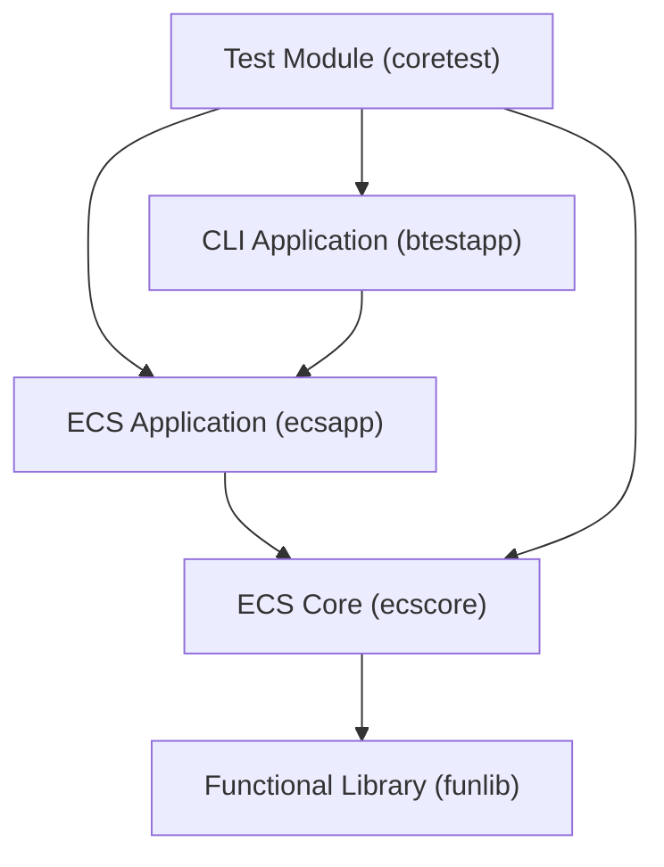
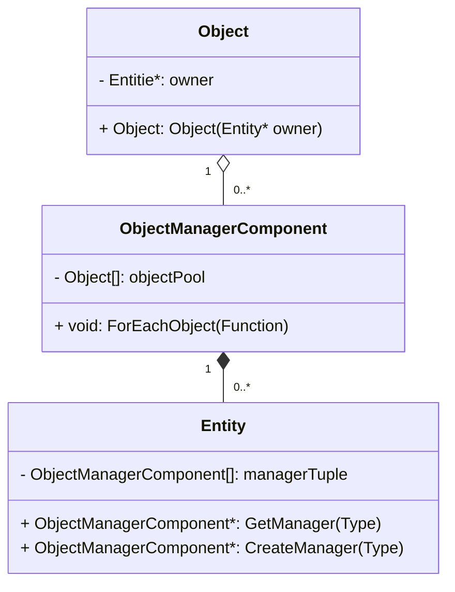
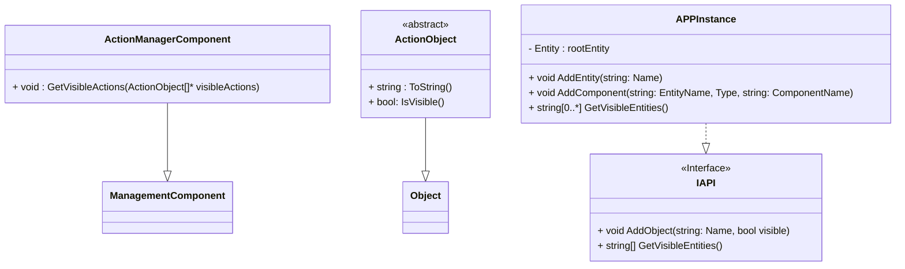

# Package Diagram

Describes mudules and their relationships

## Modules responsibilities

### CLI Application

- Parsing CLI commands
- Send messages to **ECS Core** and receive results
- Printing and format results
- Provide **how to use** documentation
- Provide CLI

### ECS Core

- Provide base classes hierarchy for extension by app code.
- Entity and Object lifecycle management.

### ECS App

- Customization of the **ECS Core**
- Implements custom classes: Action Manager and Actions
- Provide API

### Test Module

- Unit tests for **ECS Core**
- Functional tests for **CLI Application**

### Functional Library

- Provide TName template

# ECS Core Class Diagram

## ECS Core class responsibilities

### Entity

- Store managers (Single manager per type)

### ObjectManager

- Store raw references to objects
- Provide iteration over objects corresponding type

### Object

- Provide an object registration mechanism and guarantee that valid reference in the object manager

## ECS App Class Diagram

## ECS App class responsibilities

### API

- Provides API for ECS App

### APPInstance

- Provides implementation of API
- Instantiate ECS Core classes

### ManagementComponent

- Action retrieve visible actions

### ActionObject

- Provide interface for Actions
- Open for extension

