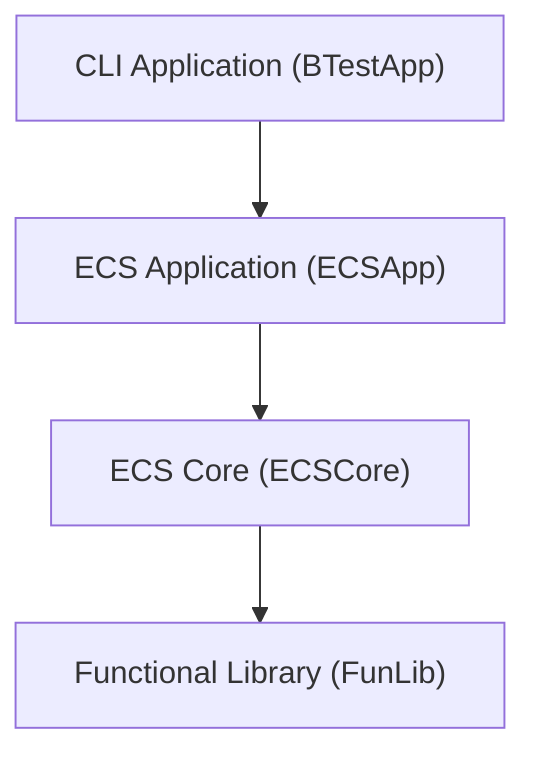
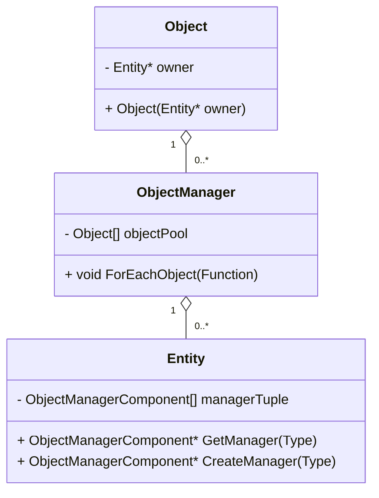
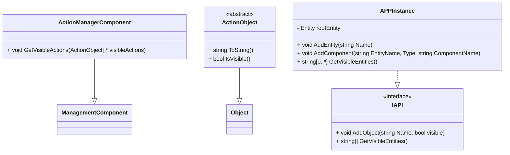

# Package Diagram

Describes modules and their relationships.  
There are no double-sided dependencies between modules. Strictly layered architecture.

## Module Responsibilities

### CLI Application

- Parse CLI commands
- Send messages to **ECS App** and receive results
- Print and format results
- Provide **how to use** documentation
- Provide CLI interface

### ECS Core

- Provide base class hierarchy for extension by app code
- Define base relationships between objects, entities, and managers

### ECS App

- Customize the **ECS Core**
- Implement custom classes: Action Manager and Actions
- Provide API

### Functional Library

- Provide custom containers

# ECS Core Class Diagram

## ECS Core Class Responsibilities

### Entity

- Stores managers (single manager per type)

### ObjectManager

- Stores raw references to objects
- Provides iteration over objects of the corresponding type
- Only one manager should hold a shared reference to the object; all other managers should hold weak references
- `PostAttachObjectToComponent` should return true if the manager holds a shared reference

### Object

- Provides an object registration mechanism and guarantees a valid reference in the object manager

## ECS App Class Diagram

## ECS App Class Responsibilities

### API

- Provides API for ECS App

### APPInstance

- Implements API
- Instantiates ECS Core classes

### ManagementComponent

- Retrieves visible actions

### ActionObject

- Provides interface for Actions
- Open for extension
